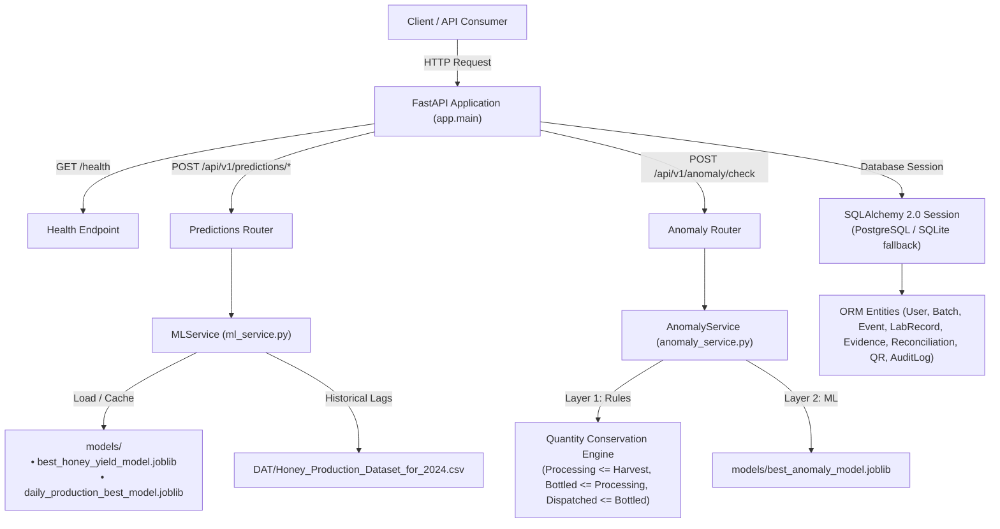

# Phase 1: FastAPI Backend Foundation — Walkthrough & Verification

## Executive Summary

Phase 1 of the **HoneyChain** backend foundation has been created and verified. The backend is built using **Python + FastAPI**, incorporating:
1. Environment configuration & dynamic model path resolution ([`backend/app/core/config.py`](file:///c:/Users/Harshini%20H/OneDrive/Desktop/sih-2026/backend/app/core/config.py))
2. Pre-trained ML inference engine for Honey Yield & Daily Production ([`backend/app/services/ml_service.py`](file:///c:/Users/Harshini%20H/OneDrive/Desktop/sih-2026/backend/app/services/ml_service.py))
3. 2-Layer Supply-Chain Anomaly Detection with authoritative deterministic mass-conservation rule enforcement ([`backend/app/services/anomaly_service.py`](file:///c:/Users/Harshini%20H/OneDrive/Desktop/sih-2026/backend/app/services/anomaly_service.py))
4. SQLAlchemy 2.0 ORM database foundation with PostgreSQL readiness and automatic SQLite fallback ([`backend/app/db/database.py`](file:///c:/Users/Harshini%20H/OneDrive/Desktop/sih-2026/backend/app/db/database.py))
5. Comprehensive unit & integration test suite (`pytest`) passing 12/12 tests in 3.21 seconds.

---

## Backend System Architecture



---

## Implemented API Endpoints

### 1. Health Endpoint
- **URL**: `GET /health` and `GET /api/v1/health`
- **Response**:
  ```json
  {
    "status": "ok",
    "service": "HoneyChain Backend"
  }
  ```

### 2. Honey Yield Prediction Endpoint
- **URL**: `POST /api/v1/predictions/yield`
- **Request Payload**:
  ```json
  {
    "environmental_temperature": 22.5,
    "relative_humidity": 75.0,
    "hive_temperature": 33.5,
    "hive_humidity": 58.0,
    "wind_speed": 4.5,
    "date": "2024-11-15"
  }
  ```
- **Response Payload**:
  ```json
  {
    "prediction_type": "honey_yield",
    "predicted_yield_kg": 14.8214,
    "model": "best_honey_yield_model"
  }
  ```

### 3. Daily Production Prediction Endpoint
- **URL**: `POST /api/v1/predictions/daily-production`
- **Request Payload**:
  ```json
  {
    "environmental_temperature": 22.5,
    "relative_humidity": 75.0,
    "hive_temperature": 33.5,
    "hive_humidity": 58.0,
    "wind_speed": 4.5,
    "date": "2024-11-15"
  }
  ```
- **Response Payload**:
  ```json
  {
    "prediction_type": "daily_honey_production",
    "predicted_production_kg": 0.2845,
    "model": "daily_production_best_model"
  }
  ```

### 4. Supply-Chain 2-Layer Anomaly Detection Endpoint
- **URL**: `POST /api/v1/anomaly/check`
- **Request Payload**:
  ```json
  {
    "batch_id": "BATCH-001",
    "harvest_quantity_kg": 50.0,
    "processing_quantity_kg": 48.0,
    "bottled_quantity_kg": 47.0,
    "dispatched_quantity_kg": 45.0
  }
  ```
- **Response Payload**:
  ```json
  {
    "batch_id": "BATCH-001",
    "rule_check": {
      "processing_vs_harvest": "PASS",
      "bottled_vs_processing": "PASS",
      "dispatched_vs_bottled": "PASS"
    },
    "gaps": {
      "processing_gap_kg": -2.0,
      "bottling_gap_kg": -1.0,
      "dispatch_gap_kg": -2.0
    },
    "ml_prediction": "NORMAL",
    "final_status": "NORMAL"
  }
  ```

---

## Pytest Test Results

Command executed:
```bash
python -m pytest backend/tests/ -v
```

```text
============================= test session starts =============================
platform win32 -- Python 3.13.13, pytest-9.1.1, pluggy-1.6.0
rootdir: C:\Users\Harshini H\OneDrive\Desktop\sih-2026
collected 12 items

backend/tests/test_anomaly.py::test_anomaly_case_1_normal PASSED         [  8%]
backend/tests/test_anomaly.py::test_anomaly_case_2_processing_anomaly PASSED [ 16%]
backend/tests/test_anomaly.py::test_anomaly_case_3_bottling_anomaly PASSED [ 25%]
backend/tests/test_anomaly.py::test_anomaly_case_4_dispatch_anomaly PASSED [ 33%]
backend/tests/test_anomaly.py::test_anomaly_case_5_multiple_violations PASSED [ 41%]
backend/tests/test_anomaly.py::test_deterministic_rules_override_ml_prediction PASSED [ 50%]
backend/tests/test_anomaly.py::test_anomaly_negative_quantities_validation PASSED [ 58%]
backend/tests/test_health.py::test_health_check_top_level PASSED         [ 66%]
backend/tests/test_health.py::test_health_check_versioned PASSED         [ 75%]
backend/tests/test_predictions.py::test_honey_yield_prediction_valid PASSED [ 83%]
backend/tests/test_predictions.py::test_daily_production_prediction_valid PASSED [ 91%]
backend/tests/test_predictions.py::test_yield_prediction_invalid_payload PASSED [100%]

============================= 12 passed in 3.21s ==============================
```
